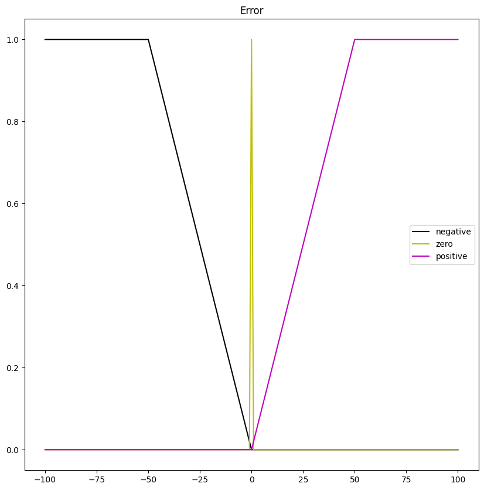
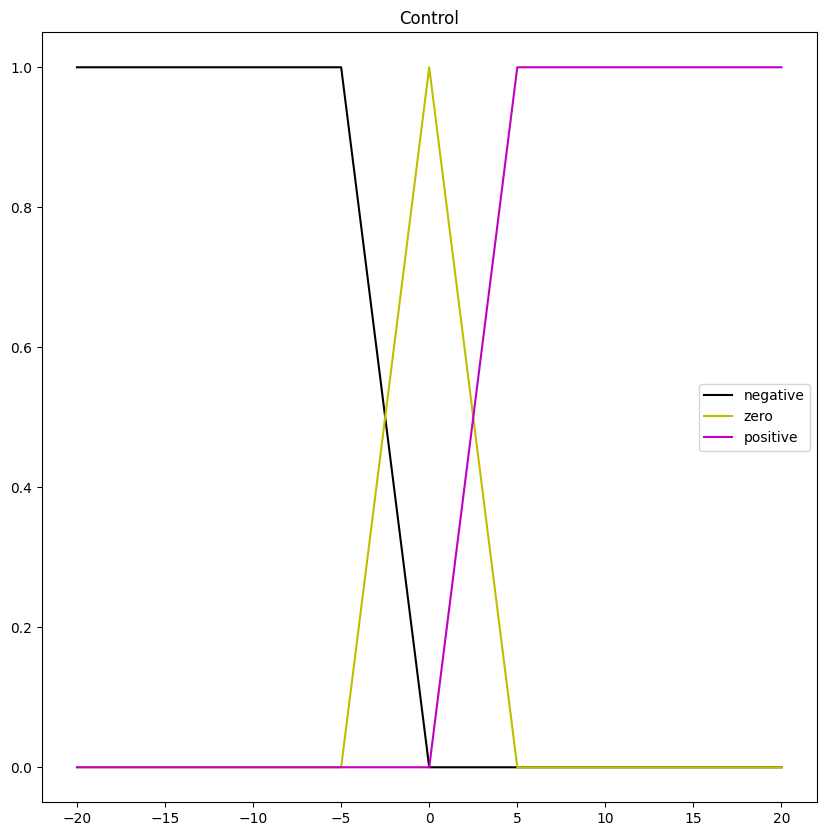
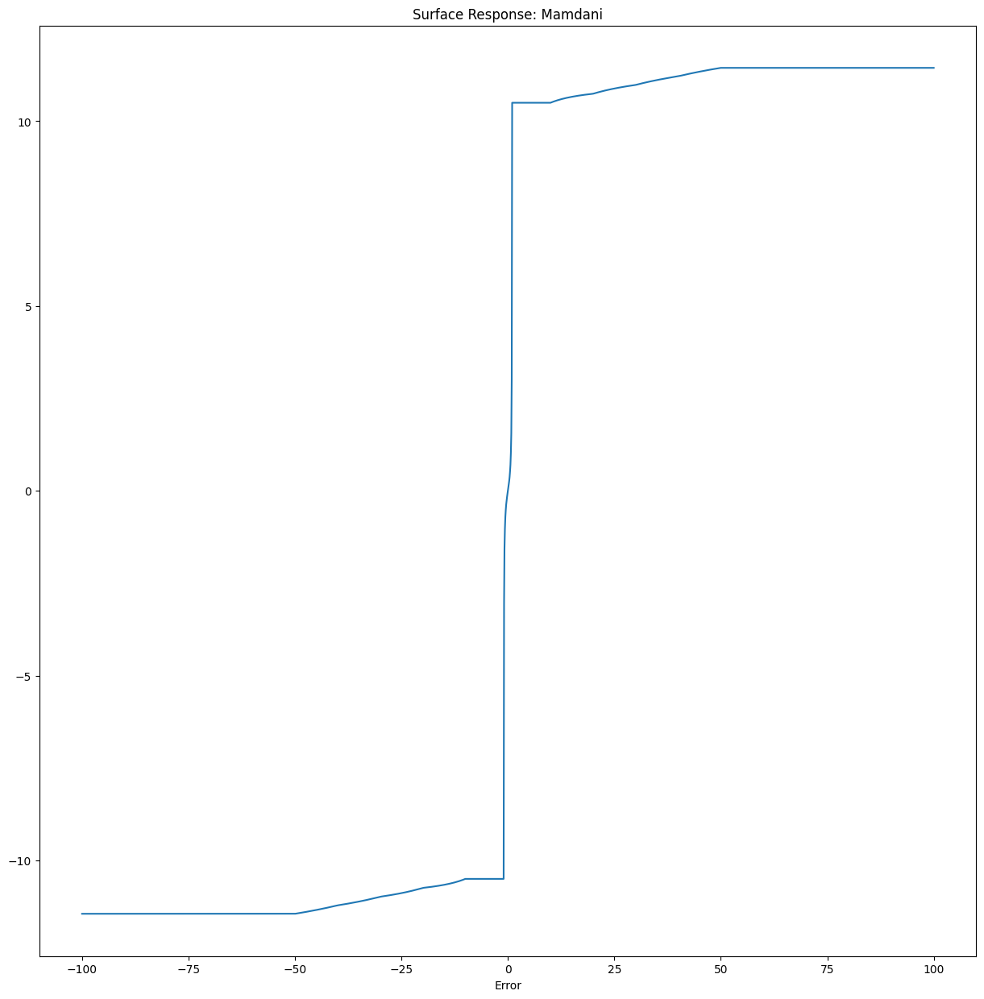
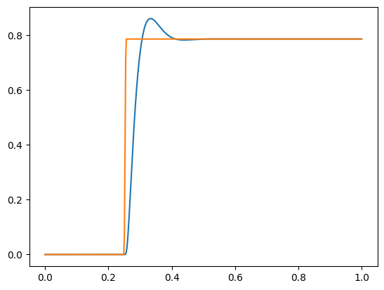

<h1 align="center">

</h1><br>

[](
https://pypi.org/project/UPAFuzzySystems/)

# UPAFuzzySystems

UPAFuzzySystems library that allows defining Fuzzy Inference Systems for different applications with continuous and discrete universes, it also deploys structures for the simulation of fuzzy control with transfer functions and state space models.

***Developed by Dr. Martín Montes Rivera***

# Installation
For installation, just run the command:

```
pip install UPAFuzzySystems==0.2.4
```
# Documentation

Here is an example for defining a one-input Mamdani controller, viewing the input and output fuzzy sets, obtaining its behavior surface, and simulating the controller with a transfer function defined by the Python control library.

First, we import the required libraries for working with the transfer function, numpy arrays, and plotting and defining the fuzzy controller.

```python
import control
import numpy as np
import matplotlib.pyplot as plt
import UPAFuzzySystems as UPAfs
```
After importing the libraries, we define the error input universe. In this case the set of integers in ranges $[-100,100]$.

```math
Error= \lbrace x ∈ Z : -100 ≤ x ≤ 100 \rbrace \tag{1}
```

Then, its fuzzy sets. 

```math
NegativeError = trapezoid(x; -100,-100,-50,0) \tag{2}
```

```math
ZeroError = triangle(x; -1,0,1) \tag{3}
```

```math
PositiveError = trapezoid(x; 0,50,100,100) \tag{4}
```

The code shows how to define and plot the input universe and its fuzzy sets with UPAFuzzySystems.
```python
#Input Universe
Error_universe = UPAfs.fuzzy_universe('Error', np.arange(-100,101,1), 'continuous')
Error_universe.add_fuzzyset('negative','trapmf',[-100,-100,-50,0])
Error_universe.add_fuzzyset('zero','trimf',[-1,0,1])
Error_universe.add_fuzzyset('positive','trapmf',[0,50,100,100])
Error_universe.view_fuzzy()
```
The plot obtained of the input universe is in the figure below:

<h1 align="center">

</h1><br>

Similarly, we define the control output universe and its fuzzy sets. In this case defining a set of integers in ranges $[-20,20]$.

```math
Control= \lbrace x ∈ Z : -20 ≤ x ≤ 20 \rbrace \tag{5}
```

Then, its fuzzy sets. 

```math
NegativeControl = trapezoid(x; -20,-20,-5,0) \tag{6}
```

```math
ZeroControl = triangle(x; -5,0,5) \tag{7}
```

```math
PositiveControl = trapezoid(x; 0,5,20,20) \tag{8}
```

The code shows how to define and plot the output universe and its fuzzy sets with UPAFuzzySystems.

```python
#Output Universe
Control_universe = UPAfs.fuzzy_universe('Control', np.arange(-20,21,1), 'continuous')
Control_universe.add_fuzzyset('negative','trapmf',[-20,-20,-5,0])
Control_universe.add_fuzzyset('zero','trimf',[-5,-0,5])
Control_universe.add_fuzzyset('positive','trapmf',[0,5,20,20])
Control_universe.view_fuzzy()
```
The plot obtained of the output universe is in the figure below:

<h1 align="center">

</h1><br>

After defining error and control universes we define which is the premise and the consequence. Then we specify the rules of the inference system.

```math
NegativeError \rightarrow NegativeControl
```

```math
ZerroError \rightarrow ZeroControl
```

```math
PositiveError \rightarrow PositiveControl
```

The code below shows the how to configure a Mamdani inference system with UPAFuzzySystems for defining its premise, consequence, and rules. Additionally, we include the expected response of the inference system through its surface.

```python
 
#Defining Rules and Building Inference System
Mamdani1 = UPAfs.inference_system('Mamdani')
Mamdani1.add_premise(Error_universe)
Mamdani1.add_consequence(Control_universe)
Mamdani1.add_rule([['Error','negative']],[],[['Control','negative']])
Mamdani1.add_rule([['Error','zero']],[],[['Control','zero']])
Mamdani1.add_rule([['Error','positive']],[],[['Control','positive']])

Mamdani1.configure('Mamdani')
Mamdani1.build()

#Testing Surface
error_values = np.arange(-100,100.1,0.1)
Mamdani1.surface_fuzzy_system([error_values])
```
The figure below shows the obtained surface for the inference system.

<h1 align="center">

</h1><br>

After defining the inference system we define plant transfer function for controling the position in a DC motor in (9). 


```math
TF(s) = \frac{K}{s*((Js+b)*(Ls+R)+K^2)} \tag{9} 
```

The code below specify the transfer function, its parameters and creates an input step for making the controller to folow a reference of 45º degrees.

```python
#Defining the system to control (Position of a DC motor)

J = 3.2284E-6
b = 3.5077E-6
K = 0.0274
R = 4
L = 2.75E-6
te = 1.0
ns = 500
T=np.linspace(0,te,ns)
Input = [(np.radians(45)*min((t-0.25)/0.005,1)) if t> 0.25 else 0 for t in T]

s = control.TransferFunction.s 
TF = K/(s*((J*s+b)*(L*s+R)+K**2))
```
Then we configure the controller for working with the transfer function using UPAFuzzySystems.

```python
# Building the Controller and obtaining system blocks for simulation
Mamdani1FuzzController = UPAfs.fuzzy_controller(Mamdani1,typec='Fuzzy1',tf=TF,DT = T[1])
Mamdani1FuzzController.build()
Mamdani1FuzzControllerBlock = Mamdani1FuzzController.get_controller()
Mamdani1FuzzSystemBlock = Mamdani1FuzzController.get_system()

```
Once obtained the blocks for simulation, you can simulate using the input_output_response method of the Python control library. Finally, we plot the obtained results.

```python
# Performing simulation and showing results

T, Theta = control.input_output_response(Mamdani1FuzzSystemBlock,T,Input,0)

plt.plot(T,Theta)
plt.plot(T,Input)
plt.show()


```

The results obtained for controlling position of a DC motor with a Mamdani fuzzy controller defined with UPAFuzzySystems are in the figure below.

<h1 align="center">

</h1><br>

For more details and other controllers check out the Jupyter Notebook notebook, PDF or HTML examples for using the UPAFuzzySystems library.

[Jupyter notebook](https://github.com/UniversidadPolitecnicaAguascalientes/UPAFuzzySystems/blob/main/examples/Examples-UPAFuzzySystems.ipynb)

[PDF](https://github.com/UniversidadPolitecnicaAguascalientes/UPAFuzzySystems/blob/main/examples/Examples-UPAFuzzySystems.pdf)

[HTML](https://github.com/UniversidadPolitecnicaAguascalientes/UPAFuzzySystems/blob/main/examples/Examples-UPAFuzzySystems.html)

[Other examples](https://github.com/UniversidadPolitecnicaAguascalientes/UPAFuzzySystems/tree/main/examples/other%20examples)

# Please cite as:
Have you found this software useful for your research?  Please cite it as:

Montes Rivera, M.; Olvera-Gonzalez, E.; Escalante-Garcia, N. UPAFuzzySystems: A Python Library for Control and Simulation with Fuzzy Inference Systems. Machines 2023, 11, 572. https://doi.org/10.3390/machines11050572
